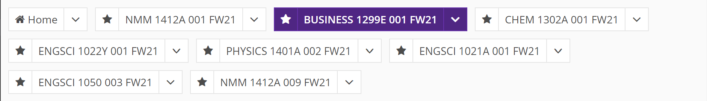
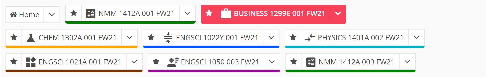
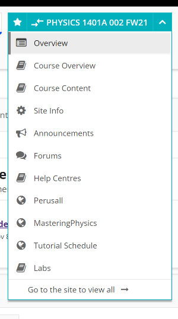

# Moonlight
Moonlight is a Chrome extension that adds an icon and highlight color to Western University’s OWL navigation bar, to make finding individual classes faster.

Before:

After:

Moonlight also consistently colors active states and additional elements, to be more consistent:

## Adding classes
Moonlight relies on an internal list of classes, so if you know of some classes that are not already in the list, please create an issue or reach out with a recommended **Material Symbol** from [Google Fonts](https://fonts.google.com/icons), and a color with **preferred white foreground text.**